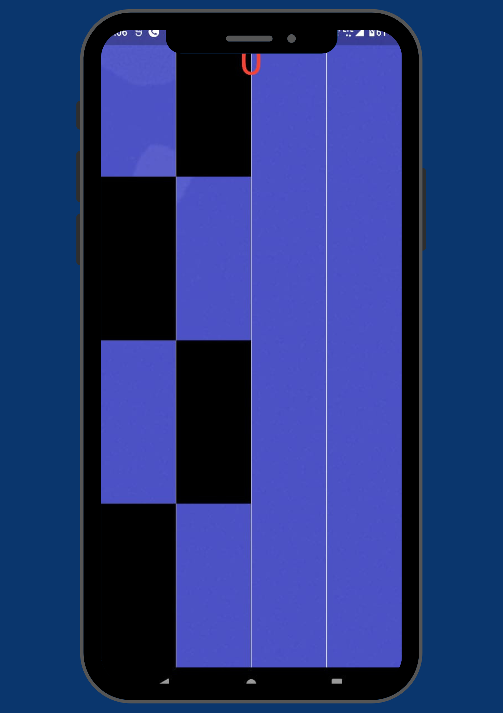
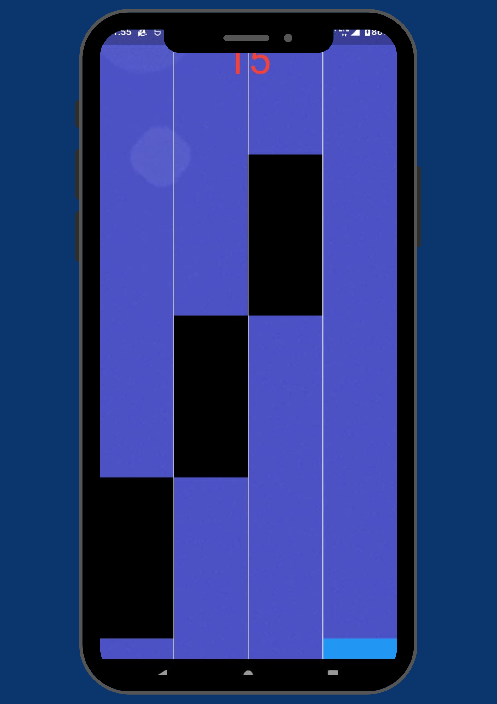
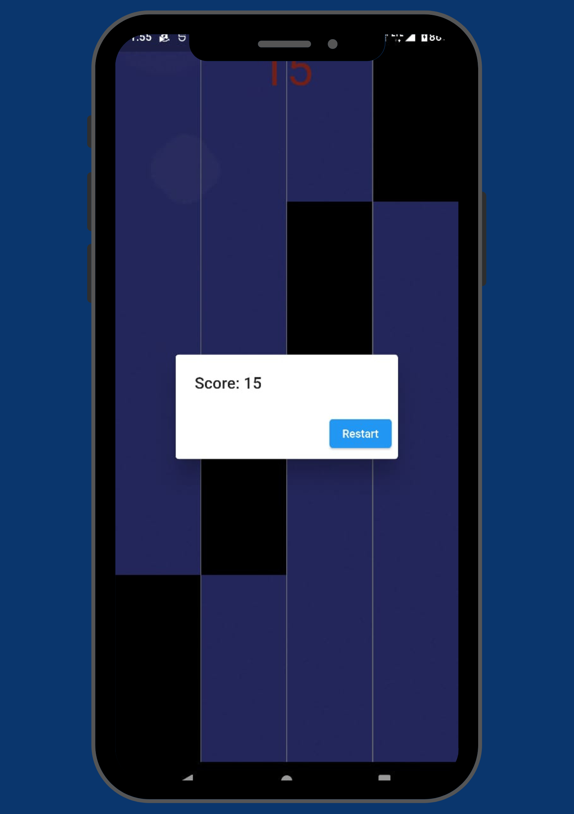

# Piano Tiles Game

Welcome to Piano Tiles Game, a fun and addictive game built with Flutter!

## Description

Piano Tiles is an engaging and addictive game where players tap on black tiles to the rhythm of music.

## Gameplay

- Tap the black tiles to play the music and progress through the levels.
- Avoid tapping on blue tiles or missing any black tiles to maintain your score.
- Challenge your friends and aim for the highest score!

## Screenshots

Here are some screenshots of the game:

*Caption: Start Screen*

*Caption: Gameplay Screen*

*Caption: Final Screen*

## Installation

To run the app locally, follow these steps:

1. Clone this repository to your local machine.
2. Make sure you have Flutter installed. If not, follow the [Flutter installation guide](https://flutter.dev/docs/get-started/install).
3. Navigate to the project directory in your terminal.
4. Run `flutter pub get` to install dependencies.
5. Connect your device or start a simulator.
6. Run `flutter run` to start the app.

## Contributing

Contributions are welcome! If you have any ideas for new features or improvements, feel free to open an issue or submit a pull request.

